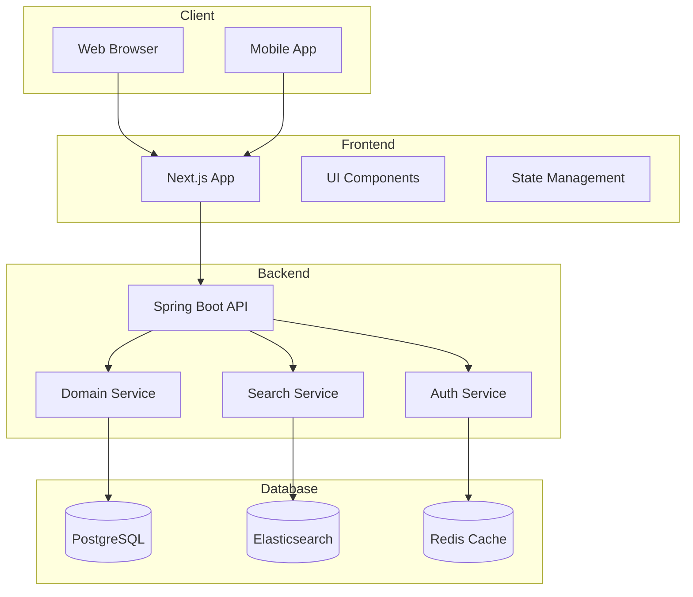
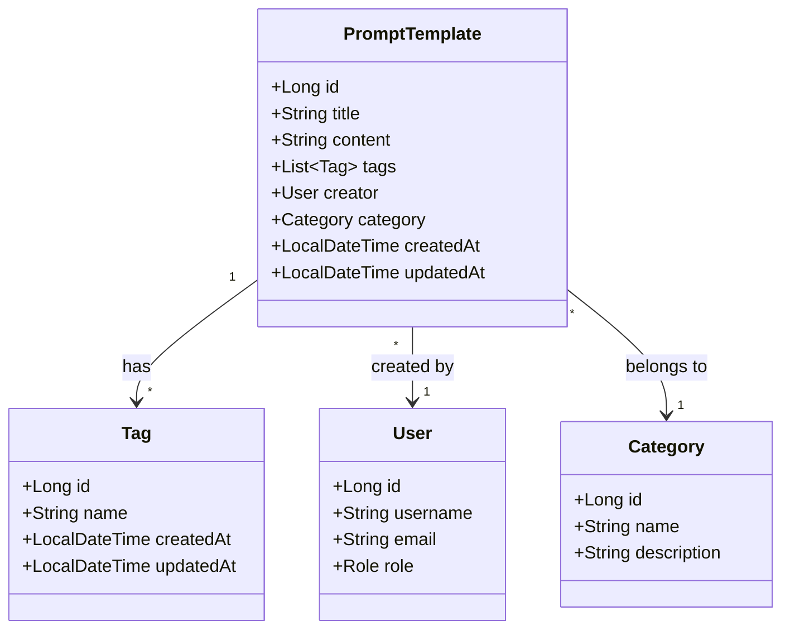

# 🏗️ 시스템 아키텍처 설계 문서

## 📝 개요
이 문서는 프롬프트 템플릿 중앙화 서버의 시스템 아키텍처를 정의합니다. Clean Architecture와 Hexagonal Architecture 원칙을 기반으로 하며, 확장성과 유지보수성을 고려한 설계를 제공합니다.

## 🎯 아키텍처 목표
1. 높은 확장성과 유지보수성
2. 도메인 중심 설계
3. 테스트 용이성
4. 보안성 강화
5. 성능 최적화

## 🔄 시스템 구성도

## 🏛️ 레이어드 아키텍처

### 1. 프레젠테이션 레이어 (Presentation Layer)
- **기술 스택**: Next.js, TypeScript, TailwindCSS
- **주요 컴포넌트**:
  - 페이지 컴포넌트
  - UI 컴포넌트
  - 상태 관리 (React Query/SWR)
  - API 클라이언트

### 2. 애플리케이션 레이어 (Application Layer)
- **기술 스택**: Spring Boot, Java 17
- **주요 컴포넌트**:
  - API 컨트롤러 (@RestController)
  - 요청/응답 DTO
  - 유스케이스 구현 (서비스 클래스)
  - 의존성 주입
- **CQRS 패턴 적용**:
  - Command 서비스: 데이터 변경 작업 처리
  - Query 서비스: 데이터 조회 작업 처리

### 3. 도메인 레이어 (Domain Layer)
- **주요 컴포넌트**:
  - 도메인 모델 (엔티티 클래스)
  - 도메인 서비스
  - 도메인 이벤트
  - 비즈니스 규칙

### 4. 인프라스트럭처 레이어 (Infrastructure Layer)
- **데이터베이스**:
  - PostgreSQL: 메인 데이터 저장
  - Elasticsearch: 검색 엔진
  - Redis: 캐싱 및 세션 관리
- **외부 서비스**:
  - 인증 서비스
  - 파일 스토리지
  - 모니터링 시스템
- **CQRS 기반 분리**:
  - Command 어댑터: 데이터 변경 작업 담당
  - Query 어댑터: 데이터 조회 작업 담당 (읽기 전용 최적화)

## 🧩 헥사고날 아키텍처 (포트 & 어댑터)

### 1. 도메인 중심부
- **위치**: `com.gongdel.promptserver.domain.model`
- **내용**: 핵심 도메인 모델, 엔티티 및 값 객체

### 2. 포트 (Ports)
- **인바운드 포트**:
  - **위치**: `com.gongdel.promptserver.application.port.in`
  - **내용**: 애플리케이션 내부로 들어오는 요청을 처리하는 인터페이스 (UseCase)
  - **CQRS 적용**: CommandUseCase와 QueryUseCase로 분리
- **아웃바운드 포트**:
  - **위치**: `com.gongdel.promptserver.application.port.out`
  - **내용**: 애플리케이션 외부로 나가는 요청을 처리하는 인터페이스 (Port)
  - **CQRS 적용**:
    - Command 포트: 저장(Save), 수정(Update), 삭제(Delete) 등 작업 담당
    - Query 포트: 단일 조회(Load), 목록 조회(Find), 검색(Search) 등 작업 담당

### 3. 어댑터 (Adapters)
- **인바운드 어댑터**:
  - **위치**: `com.gongdel.promptserver.adapter.in.rest`
  - **내용**: API 컨트롤러, 요청/응답 DTO, 웹 관련 구성 요소
  - **CQRS 적용**: Command 컨트롤러와 Query 컨트롤러로 분리
- **아웃바운드 어댑터**:
  - **위치**: `com.gongdel.promptserver.adapter.out.persistence`
  - **내용**: 데이터베이스 접근 구현체, 외부 API 클라이언트
  - **CQRS 적용**:
    - Command 어댑터: 쓰기 작업 관련 트랜잭션 처리
    - Query 어댑터: 읽기 전용 트랜잭션 및 캐싱 최적화

### 4. 애플리케이션 서비스
- **위치**: `com.gongdel.promptserver.application.usecase`
- **내용**: 유스케이스 구현, 비즈니스 로직 오케스트레이션
- **CQRS 적용**:
  - **Command 서비스**:
    - 위치: `com.gongdel.promptserver.application.service.command`
    - 내용: 데이터 변경 작업을 수행하는 유스케이스 구현
    - 예: `RegisterPromptService`, `UpdatePromptService`, `DeletePromptService`
  - **Query 서비스**:
    - 위치: `com.gongdel.promptserver.application.service.query`
    - 내용: 데이터 조회 작업을 수행하는 유스케이스 구현
    - 예: `GetPromptService`, `SearchPromptsService`, `ListPromptsService`

### 5. 설정 및 공통 요소
- **위치**: `com.gongdel.promptserver.common`
- **내용**: 공통 유틸리티, 예외 처리, 설정 클래스

## 🌐 도메인 모델 구조

## 🔐 보안 아키텍처

### 1. 인증 및 인가
- Spring Security 기반 인증
- JWT 기반 인증
- OAuth 2.0 지원
- 역할 기반 접근 제어 (RBAC)
- API 키 관리

### 2. 데이터 보안
- HTTPS/TLS 적용
- 데이터 암호화
- SQL 인젝션 방지 (JPA/Hibernate 활용)
- XSS/CSRF 방어

## 📊 성능 최적화

### 1. 저장소 전략
- **PostgreSQL(RDB)**
  - 정본 데이터 저장
  - 트랜잭션, 제약조건, 롤백 지원
  - 관계/이력/권한 관리
  - 업데이트/삭제/감사 로그

- **Elasticsearch(ES)**
  - 검색/필터링 최적화
  - Full-text 검색
  - 복합 조건 검색
  - 읽기 전용 모델 (denormalized)

### 2. CQRS 패턴 적용
- **Command (쓰기)**
  - 데이터 생성/수정/삭제
  - 트랜잭션 처리
  - 이벤트 발행 (ES 동기화)
  - 권한 검증

- **Query (읽기)**
  - 검색/필터링
  - 관계 조회
  - 캐싱 적용
  - 읽기 전용 트랜잭션

### 3. 동기화 전략
- **이벤트 기반 동기화**
  - RDB 변경 → 이벤트 발행 → ES 업데이트
  - 비동기 처리로 RDB 성능 영향 최소화
  - 재시도/장애 복구 메커니즘
  - 최종 일관성(Eventual Consistency) 보장

- **동기화 데이터 구조**
  - 검색에 필요한 필드만 포함
  - Denormalized 형태로 저장
  - 관계 데이터 포함
  - 메타데이터 포함

### 4. 조회 전략
- **RDB 조회**
  - 상세 정보 조회
  - 관계/이력 조회
  - 권한 검증
  - 트랜잭션 처리

- **ES 조회**
  - 검색/필터링
  - 복합 조건 검색
  - 정렬/페이징
  - 캐싱 적용

### 5. 캐싱 전략
- **Redis 캐싱**
  - 자주 사용되는 데이터
  - 검색 결과
  - 관계 데이터
  - 메타데이터

- **캐시 정책**
  - TTL(Time To Live) 설정
  - LRU(Least Recently Used) 정책
  - Write-through/Write-behind
  - 캐시 무효화 전략

### 6. 인덱싱 전략
- **RDB 인덱스**
  - 외래키 인덱스
  - 검색 조건 인덱스
  - 복합 인덱스
  - 부분 인덱스

- **ES 인덱스**
  - 검색 필드 인덱스
  - 관계 필드 인덱스
  - 동적 매핑
  - 인덱스 별칭

### 7. 장애 대응
- **동기화 실패**
  - 재시도 큐
  - 주기적 재동기화
  - 수동 동기화 메커니즘
  - 장애 알림

- **데이터 정합성**
  - RDB → ES 단방향 동기화
  - ES 데이터 재생성 가능
  - 정기적 검증 작업
  - 백업/복구 전략

### 8. 모니터링
- **성능 메트릭**
  - 응답 시간
  - 동기화 지연
  - 캐시 히트율
  - 리소스 사용량

- **알림**
  - 동기화 실패
  - 성능 저하
  - 리소스 부족
  - 장애 발생

## 🔄 배포 아키텍처

### 1. 컨테이너화
- Docker 컨테이너
- Docker Compose 개발 환경
- 쿠버네티스 운영 환경

### 2. CI/CD 파이프라인
- GitLab CI/CD
- 자동화된 테스트
- 자동 배포

### 3. 모니터링
- Prometheus + Grafana
- ELK Stack
- Spring Actuator
- 알림 시스템

## 📈 확장성 전략

### 1. 수평적 확장
- 스테이트리스 아키텍처
- 로드 밸런싱
- 데이터베이스 샤딩

### 2. 마이크로서비스 전환 가능성
- 도메인 기반 서비스 분리
- 이벤트 기반 통신 (Spring Cloud Stream)
- API 게이트웨이 (Spring Cloud Gateway)

## 🧪 테스트 전략

### 1. 단위 테스트
- JUnit 5 기반 테스트
- Mockito를 활용한 모킹
- 도메인 로직 테스트
- 서비스 레이어 테스트
- 유틸리티 테스트

### 2. 통합 테스트
- Spring Boot Test
- TestContainers
- API 엔드포인트 테스트
- 데이터베이스 통합 테스트
- 외부 서비스 통합 테스트

### 3. E2E 테스트
- Cypress 기반 UI 테스트
- 사용자 시나리오 테스트
- 성능 테스트 (JMeter)

## 🔄 장애 대응

### 1. 고가용성
- 다중화 구성
- 장애 복구 자동화
- 백업 및 복구 전략

### 2. 모니터링 및 알림
- 실시간 모니터링
- 장애 감지 및 알림
- 성능 메트릭 수집

## 📝 개발 가이드라인

### 1. 코드 스타일
- Google Java Style Guide
- ESLint + Prettier (TypeScript)
- 코드 리뷰 프로세스

### 2. 문서화
- OpenAPI/Swagger 문서
- 아키텍처 문서
- 개발 가이드
- JavaDoc

### 3. 버전 관리
- Git Flow
- 시맨틱 버저닝
- 변경 이력 관리
