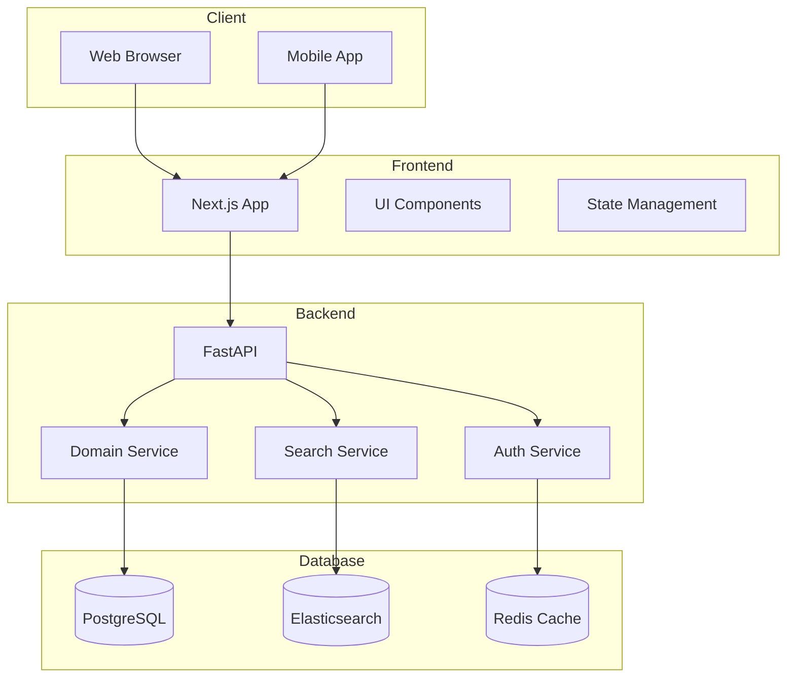

# 🏗️ 시스템 아키텍처 설계 문서

## 📝 개요
이 문서는 프롬프트 템플릿 중앙화 서버의 시스템 아키텍처를 정의합니다. Clean Architecture와 Hexagonal Architecture 원칙을 기반으로 하며, 확장성과 유지보수성을 고려한 설계를 제공합니다.

## 🎯 아키텍처 목표
1. 높은 확장성과 유지보수성
2. 도메인 중심 설계
3. 테스트 용이성
4. 보안성 강화
5. 성능 최적화

## 🔄 시스템 구성도

## 🏛️ 레이어드 아키텍처

### 1. 프레젠테이션 레이어 (Presentation Layer)
- **기술 스택**: Next.js, TypeScript, TailwindCSS
- **주요 컴포넌트**:
  - 페이지 컴포넌트
  - UI 컴포넌트
  - 상태 관리 (React Query/SWR)
  - API 클라이언트

### 2. 애플리케이션 레이어 (Application Layer)
- **기술 스택**: FastAPI, Python 3.11
- **주요 컴포넌트**:
  - API 엔드포인트
  - 요청/응답 DTO
  - 유스케이스 구현
  - 의존성 주입

### 3. 도메인 레이어 (Domain Layer)
- **주요 컴포넌트**:
  - 도메인 모델
  - 도메인 서비스
  - 도메인 이벤트
  - 비즈니스 규칙

### 4. 인프라스트럭처 레이어 (Infrastructure Layer)
- **데이터베이스**:
  - PostgreSQL: 메인 데이터 저장
  - Elasticsearch: 검색 엔진
  - Redis: 캐싱 및 세션 관리
- **외부 서비스**:
  - 인증 서비스
  - 파일 스토리지
  - 모니터링 시스템

## 🔐 보안 아키텍처

### 1. 인증 및 인가
- JWT 기반 인증
- OAuth 2.0 지원
- 역할 기반 접근 제어 (RBAC)
- API 키 관리

### 2. 데이터 보안
- HTTPS/TLS 적용
- 데이터 암호화
- SQL 인젝션 방지
- XSS/CSRF 방어

## 📊 성능 최적화

### 1. 캐싱 전략
- Redis를 이용한 세션 캐싱
- 자주 사용되는 프롬프트 캐싱
- API 응답 캐싱

### 2. 데이터베이스 최적화
- 인덱스 전략
- 쿼리 최적화
- 커넥션 풀링

### 3. 검색 최적화
- Elasticsearch 인덱싱
- 검색 결과 캐싱
- 부분 검색 지원

## 🔄 배포 아키텍처

### 1. 컨테이너화
- Docker 컨테이너
- Docker Compose 개발 환경
- 쿠버네티스 운영 환경

### 2. CI/CD 파이프라인
- GitLab CI/CD
- 자동화된 테스트
- 자동 배포

### 3. 모니터링
- Prometheus + Grafana
- ELK Stack
- 알림 시스템

## 📈 확장성 전략

### 1. 수평적 확장
- 스테이트리스 아키텍처
- 로드 밸런싱
- 데이터베이스 샤딩

### 2. 마이크로서비스 전환 가능성
- 도메인 기반 서비스 분리
- 이벤트 기반 통신
- API 게이트웨이

## 🧪 테스트 전략

### 1. 단위 테스트
- 도메인 로직 테스트
- 서비스 레이어 테스트
- 유틸리티 테스트

### 2. 통합 테스트
- API 엔드포인트 테스트
- 데이터베이스 통합 테스트
- 외부 서비스 통합 테스트

### 3. E2E 테스트
- Cypress 기반 UI 테스트
- 사용자 시나리오 테스트
- 성능 테스트

## 🔄 장애 대응

### 1. 고가용성
- 다중화 구성
- 장애 복구 자동화
- 백업 및 복구 전략

### 2. 모니터링 및 알림
- 실시간 모니터링
- 장애 감지 및 알림
- 성능 메트릭 수집

## 📝 개발 가이드라인

### 1. 코드 스타일
- PEP 8 (Python)
- ESLint + Prettier (TypeScript)
- 코드 리뷰 프로세스

### 2. 문서화
- API 문서 (OpenAPI/Swagger)
- 아키텍처 문서
- 개발 가이드

### 3. 버전 관리
- Git Flow
- 시맨틱 버저닝
- 변경 이력 관리
