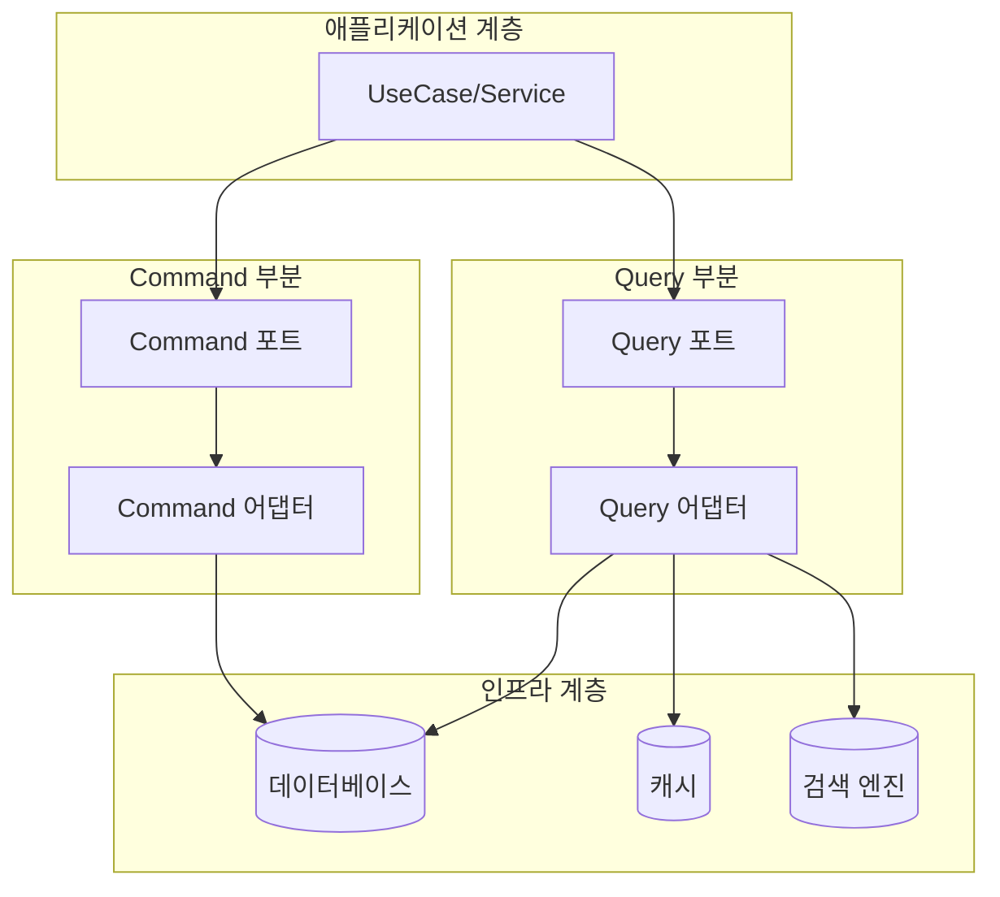

# 🔄 CQRS (Command Query Responsibility Segregation) 패턴 가이드

## 📝 개요
CQRS는 명령(Command)과 조회(Query)의 책임을 분리하는 아키텍처 패턴입니다. 이 패턴은 시스템의 읽기와 쓰기 작업을 분리하여 각각 최적화할 수 있게 합니다.

## 🎯 적용 목표
1. 명확한 책임 분리
2. 성능 최적화
3. 확장성 향상
4. 유지보수성 강화
5. 테스트 용이성 증대

## 🔄 패턴 구조



## ⚙️ 포트 분리 가이드

### 1. Command(Write) 포트
Command 포트는 데이터를 변경하는 작업을 담당합니다.

```java
// 저장 포트
public interface SavePromptPort {
    PromptTemplate savePrompt(PromptTemplate promptTemplate);
}

// 업데이트 포트
public interface UpdatePromptPort {
    PromptTemplate updatePrompt(PromptTemplate promptTemplate);
}

// 삭제 포트
public interface DeletePromptPort {
    void deletePrompt(Long id);
}
```

### 2. Query(Read) 포트
Query 포트는 데이터를 조회하는 작업을 담당하며, 목적에 따라 다시 세분화됩니다.

```java
// 단일 엔티티 조회 포트
public interface LoadPromptPort {
    Optional<PromptTemplate> loadPromptById(Long id);
    Optional<PromptTemplate> loadPromptByUuid(UUID uuid);
}

// 필터링된 목록 조회 포트
public interface FindPromptsPort {
    Page<PromptTemplate> findPromptsByCreatedByAndStatus(User user, PromptStatus status, Pageable pageable);
    Page<PromptTemplate> findPromptsByVisibilityAndStatus(Visibility visibility, PromptStatus status, Pageable pageable);
    Page<PromptTemplate> findPromptsByCategoryAndStatus(Category category, PromptStatus status, Pageable pageable);
}

// 검색 포트
public interface SearchPromptsPort {
    Page<PromptTemplate> searchPromptsByTagAndStatus(String tag, PromptStatus status, Pageable pageable);
    Page<PromptTemplate> searchPromptsByKeywordAndStatus(String keyword, PromptStatus status, Pageable pageable);
}
```

## 🧩 어댑터 구현 가이드

### 1. Command 어댑터
```java
@Component
@RequiredArgsConstructor
@Transactional
public class PromptCommandAdapter implements SavePromptPort, UpdatePromptPort, DeletePromptPort {
    private final PromptTemplateJpaRepository promptRepository;

    @Override
    public PromptTemplate savePrompt(PromptTemplate promptTemplate) {
        PromptTemplateEntity entity = PromptTemplateEntity.fromDomain(promptTemplate);
        PromptTemplateEntity savedEntity = promptRepository.save(entity);
        return savedEntity.toDomain();
    }

    @Override
    public PromptTemplate updatePrompt(PromptTemplate promptTemplate) {
        // 업데이트 구현
    }

    @Override
    public void deletePrompt(Long id) {
        promptRepository.deleteById(id);
    }
}
```

### 2. Query 어댑터
```java
@Component
@RequiredArgsConstructor
@Transactional(readOnly = true) // 읽기 전용 트랜잭션으로 성능 최적화
public class PromptQueryAdapter implements LoadPromptPort, FindPromptsPort, SearchPromptsPort {
    private final PromptTemplateJpaRepository promptRepository;

    @Override
    public Optional<PromptTemplate> loadPromptById(Long id) {
        return promptRepository.findById(id)
                .map(PromptTemplateEntity::toDomain);
    }

    // 다른 메서드들 구현
}
```

## 🔄 포트 분리 원칙

### 단일 엔티티 조회 vs 컬렉션 조회 vs 검색 조회
이 세 가지 타입의 조회는 각각 다른 특성과 최적화 전략을 가지므로 분리합니다:

1. **LoadPromptPort (단일 엔티티 조회)**
   - ID 또는 UUID 같은 식별자로 조회
   - 대부분 1:1 결과 반환
   - 캐싱에 최적화 가능
   - 항상 존재해야 하는 데이터 조회

2. **FindPromptsPort (필터링된 목록 조회)**
   - 비즈니스 로직 기반 필터링
   - 페이지네이션 적용
   - 일반적인 목록 화면에 사용
   - 기본 정렬 및 필터링 제공

3. **SearchPromptsPort (검색 조회)**
   - 사용자 입력 키워드 기반 검색
   - 전문 검색 기능 (태그, 키워드 등)
   - Elasticsearch 같은 검색 엔진 연동 가능
   - 복잡한 검색 조건 지원

## 📋 프로젝트 적용 가이드

### 패키지 구조
```
/src/main/java/com/gongdel/promptserver
│
├── application/
│   ├── port/
│   │   ├── in/   # 유스케이스 (인바운드 포트)
│   │   └── out/  # 아웃바운드 포트
│   │       ├── command/
│   │       │   ├── SavePromptPort.java
│   │       │   ├── UpdatePromptPort.java
│   │       │   └── DeletePromptPort.java
│   │       └── query/
│   │           ├── LoadPromptPort.java
│   │           ├── FindPromptsPort.java
│   │           └── SearchPromptsPort.java
│   └── service/  # 유스케이스 구현체
│
└── adapter/
    └── out/
        └── persistence/
            ├── command/
            │   └── PromptCommandAdapter.java
            └── query/
                └── PromptQueryAdapter.java
```

### 서비스 계층 적용
```java
@Service
@RequiredArgsConstructor
public class PromptApplicationService {
    // Command 포트
    private final SavePromptPort savePromptPort;
    private final UpdatePromptPort updatePromptPort;

    // Query 포트
    private final LoadPromptPort loadPromptPort;
    private final FindPromptsPort findPromptsPort;
    private final SearchPromptsPort searchPromptsPort;

    // 서비스 메서드들...
}
```

## 🔍 CQRS 패턴과 도메인 리포지토리의 관계

### 접근 방식 1: 완전한 CQRS 분리
- 도메인 계층에서도 목적별 포트를 직접 사용
- `PromptTemplateRepository` 같은 통합 인터페이스 제거
- UseCase가 필요한 포트만 정확히 주입받아 사용

### 접근 방식 2: 도메인 추상화 유지
- 도메인 계층은 여전히 통합 리포지토리 인터페이스 사용
- 리포지토리 구현체 내부에서 CQRS 포트 활용
- 도메인 계층을 기술적 세부사항으로부터 더 잘 보호

## 🚀 성능 최적화 가능성

1. **읽기 전용 트랜잭션**
   - Query 어댑터에 `@Transactional(readOnly = true)` 적용
   - JPA/Hibernate 최적화 활용

2. **캐싱 전략**
   - LoadPromptPort 구현체에 캐싱 적용
   - 자주 사용되는 조회 결과 캐싱

3. **검색 엔진 통합**
   - SearchPromptsPort 구현체에 Elasticsearch 연동
   - 전문 검색 기능 강화

4. **읽기/쓰기 데이터베이스 분리**
   - Command 어댑터와 Query 어댑터가 다른 데이터 소스 사용 가능
   - 고급 확장 가능성 제공

## 🔄 마이그레이션 전략

기존 코드베이스에서 CQRS 패턴으로 점진적인 마이그레이션이 가능합니다:

1. 기존 리포지토리 인터페이스 및 구현 유지
2. 새로운 CQRS 포트 및 어댑터 생성
3. 리포지토리 구현체에서 CQRS 어댑터 활용하도록 리팩토링
4. 서비스 계층에서 점진적으로 직접 CQRS 포트 사용으로 전환
