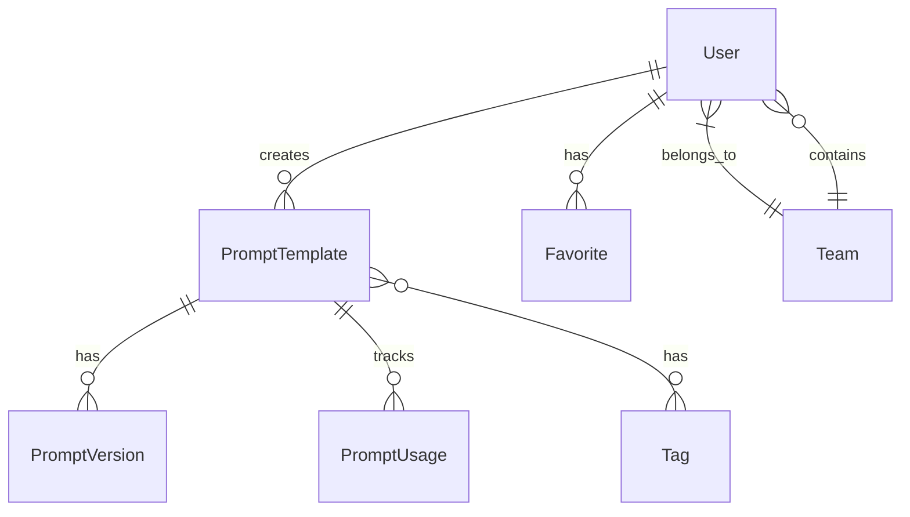

# 🗃️ 데이터 모델 설계 문서

## 📝 개요
이 문서는 프롬프트 템플릿 중앙화 서버의 데이터 모델을 정의합니다. 각 엔티티의 구조와 관계를 상세히 설명하며, 시스템의 핵심 기능을 지원하기 위한 데이터 구조를 제공합니다.

## 🔄 엔티티 관계도

## 📊 엔티티 상세

### 👤 User (사용자)
사용자 정보를 관리하는 엔티티입니다.

| 필드 | 타입 | 설명 | 제약조건 |
|------|------|------|----------|
| id | UUID | 사용자 고유 식별자 | Primary Key |
| email | String | 사용자 이메일 | Unique, Not Null |
| name | String | 사용자 이름 | Not Null |
| role | Enum | 사용자 역할 | ADMIN, DEVELOPER, DATA_SCIENTIST, DESIGNER |
| team | String | 소속 팀 | Not Null |
| createdAt | DateTime | 생성 일시 | Not Null |
| updatedAt | DateTime | 수정 일시 | Not Null |
| lastLoginAt | DateTime | 마지막 로그인 일시 | Nullable |
| status | Enum | 계정 상태 | ACTIVE, INACTIVE |

### 📝 PromptTemplate (프롬프트 템플릿)
프롬프트 템플릿의 기본 정보를 저장하는 엔티티입니다.

| 필드 | 타입 | 설명 | 제약조건 |
|------|------|------|----------|
| id | UUID | 템플릿 고유 식별자 | Primary Key |
| title | String | 템플릿 제목 | Not Null |
| content | Text | 프롬프트 내용 | Not Null |
| category | Enum | 템플릿 카테고리 | API_DESIGN, ARCHITECTURE, UI_DEFINITION, DATA_ANALYSIS, UX_MESSAGE |
| tags | Array<String> | 관련 태그 목록 | Nullable |
| version | Integer | 현재 버전 | Not Null |
| createdBy | User | 생성자 | Foreign Key |
| createdAt | DateTime | 생성 일시 | Not Null |
| updatedAt | DateTime | 수정 일시 | Not Null |
| visibility | Enum | 공개 범위 | PUBLIC, TEAM, PRIVATE |
| metadata | JSON | 추가 메타데이터 | Nullable |
| status | Enum | 템플릿 상태 | DRAFT, PUBLISHED, ARCHIVED |
| usageCount | Integer | 사용 횟수 | Default: 0 |
| lastUsedAt | DateTime | 마지막 사용 일시 | Nullable |
| description | Text | 템플릿 설명 | Nullable |
| example | Text | 사용 예시 | Nullable |
| language | String | 언어 코드 | Default: "ko" |
| estimatedTokens | Integer | 예상 토큰 수 | Nullable |

### 📚 PromptVersion (프롬프트 버전)
프롬프트 템플릿의 버전 이력을 관리하는 엔티티입니다.

| 필드 | 타입 | 설명 | 제약조건 |
|------|------|------|----------|
| id | UUID | 버전 고유 식별자 | Primary Key |
| promptTemplateId | UUID | 템플릿 ID | Foreign Key |
| version | Integer | 버전 번호 | Not Null |
| content | Text | 버전별 내용 | Not Null |
| changes | Text | 변경 사항 | Nullable |
| createdBy | User | 생성자 | Foreign Key |
| createdAt | DateTime | 생성 일시 | Not Null |
| metadata | JSON | 버전별 메타데이터 | Nullable |

### ⭐ Favorite (즐겨찾기)
사용자의 즐겨찾기 정보를 관리하는 엔티티입니다.

| 필드 | 타입 | 설명 | 제약조건 |
|------|------|------|----------|
| id | UUID | 즐겨찾기 고유 식별자 | Primary Key |
| userId | UUID | 사용자 ID | Foreign Key |
| promptTemplateId | UUID | 템플릿 ID | Foreign Key |
| createdAt | DateTime | 생성 일시 | Not Null |
| note | Text | 개인 메모 | Nullable |

### 👥 Team (팀)
팀 정보를 관리하는 엔티티입니다.

| 필드 | 타입 | 설명 | 제약조건 |
|------|------|------|----------|
| id | UUID | 팀 고유 식별자 | Primary Key |
| name | String | 팀 이름 | Not Null |
| description | Text | 팀 설명 | Nullable |
| createdAt | DateTime | 생성 일시 | Not Null |
| updatedAt | DateTime | 수정 일시 | Not Null |
| members | Array<User> | 팀원 목록 | Not Null |
| status | Enum | 팀 상태 | ACTIVE, INACTIVE |

### 🏷️ Tag (태그)
프롬프트 템플릿의 태그를 관리하는 엔티티입니다.

| 필드 | 타입 | 설명 | 제약조건 |
|------|------|------|----------|
| id | UUID | 태그 고유 식별자 | Primary Key |
| name | String | 태그 이름 | Unique, Not Null |
| description | Text | 태그 설명 | Nullable |
| createdAt | DateTime | 생성 일시 | Not Null |
| updatedAt | DateTime | 수정 일시 | Not Null |
| usageCount | Integer | 사용 횟수 | Default: 0 |

### 📊 PromptUsage (프롬프트 사용)
프롬프트 템플릿의 사용 이력을 추적하는 엔티티입니다.

| 필드 | 타입 | 설명 | 제약조건 |
|------|------|------|----------|
| id | UUID | 사용 기록 고유 식별자 | Primary Key |
| promptTemplateId | UUID | 템플릿 ID | Foreign Key |
| userId | UUID | 사용자 ID | Foreign Key |
| usedAt | DateTime | 사용 일시 | Not Null |
| result | JSON | 실행 결과 | Nullable |
| duration | Integer | 실행 시간(ms) | Not Null |
| status | Enum | 실행 상태 | SUCCESS, FAILURE |
| error | Text | 에러 메시지 | Nullable |

## 🔒 데이터 무결성 규칙
1. 모든 엔티티는 UUID를 기본 키로 사용합니다.
2. 외래 키는 참조 무결성을 보장합니다.
3. 필수 필드는 Not Null 제약조건을 가집니다.
4. 이메일과 태그 이름은 유니크 제약조건을 가집니다.

## 📈 인덱스 전략
1. User: email
2. PromptTemplate: category, status, createdBy
3. Tag: name
4. PromptUsage: promptTemplateId, userId, usedAt
5. Favorite: userId, promptTemplateId

## 🔄 데이터 마이그레이션
1. 버전 관리가 필요한 엔티티는 createdAt, updatedAt 필드를 포함합니다.
2. 삭제된 데이터는 soft delete를 적용합니다.
3. 중요한 변경 사항은 PromptVersion에 기록됩니다.
