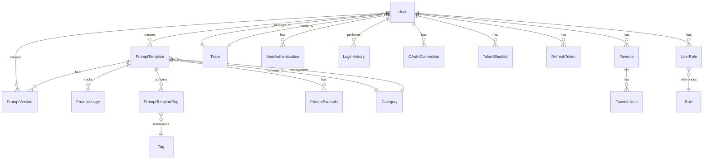

# 🗃️ 데이터 모델 설계 문서

## 📝 개요
이 문서는 프롬프트 템플릿 중앙화 서버의 데이터 모델을 정의합니다. 각 엔티티의 구조와 관계를 상세히 설명하며, 시스템의 핵심 기능을 지원하기 위한 데이터 구조를 제공합니다.

## 🔄 엔티티 관계도

## 📊 엔티티 상세

### 👤 User (사용자)
사용자 기본 정보를 관리하는 엔티티입니다.

| 필드 | 타입 | 설명 | 제약조건 |
|------|------|------|----------|
| id | BigInt | 사용자 고유 식별자 | Primary Key, Auto Increment |
| uuid | UUID | 외부 노출용 고유 식별자 | Unique, Not Null |
| email | String | 사용자 이메일 | Unique, Not Null |
| name | String | 사용자 이름 | Not Null |
| teamId | BigInt | 소속 팀 ID | Foreign Key, Nullable |
| createdAt | DateTime | 생성 일시 | Not Null |
| updatedAt | DateTime | 수정 일시 | Not Null |
| status | Enum | 계정 상태 | ACTIVE, INACTIVE, DELETED |

### 🛡️ Role (역할)
사용자 역할 정보를 관리하는 엔티티입니다.

| 필드 | 타입 | 설명 | 제약조건 |
|------|------|------|----------|
| id | BigInt | 역할 고유 식별자 | Primary Key, Auto Increment |
| uuid | UUID | 외부 노출용 고유 식별자 | Unique, Not Null |
| name | String | 역할 이름 | Unique, Not Null |
| description | Text | 역할 설명 | Nullable |

### 🔗 UserRole (사용자-역할 매핑)
사용자와 역할 간의 다대다 관계를 관리하는 엔티티입니다.

| 필드 | 타입 | 설명 | 제약조건 |
|------|------|------|----------|
| id | BigInt | 매핑 고유 식별자 | Primary Key, Auto Increment |
| uuid | UUID | 매핑 고유 식별자(글로벌 유일) | Unique, Not Null |
| userId | BigInt | 사용자 ID | Foreign Key, Not Null |
| roleId | BigInt | 역할 ID | Foreign Key, Not Null |

### 🔐 UserAuthentication (사용자 인증)
사용자 인증 정보를 별도로 관리하는 엔티티입니다.

| 필드 | 타입 | 설명 | 제약조건 |
|------|------|------|----------|
| id | BigInt | 인증 정보 고유 식별자 | Primary Key, Auto Increment |
| userId | BigInt | 사용자 ID | Foreign Key, Not Null |
| passwordHash | String | 암호화된 비밀번호 | Nullable |
| lastPasswordChangeAt | DateTime | 마지막 비밀번호 변경 일시 | Nullable |
| createdAt | DateTime | 생성 일시 | Not Null |
| updatedAt | DateTime | 수정 일시 | Not Null |

### 🔑 OAuthConnection (OAuth 연동)
OAuth 제공자와의 연동 정보를 관리하는 엔티티입니다.

| 필드 | 타입 | 설명 | 제약조건 |
|------|------|------|----------|
| id | BigInt | 연동 정보 고유 식별자 | Primary Key, Auto Increment |
| userId | BigInt | 사용자 ID | Foreign Key, Not Null |
| provider | Enum | OAuth 제공자 | GOOGLE, GITHUB |
| providerUserId | String | OAuth 제공자의 사용자 ID | Not Null |
| accessToken | String | OAuth 액세스 토큰 | Not Null |
| refreshToken | String | OAuth 리프레시 토큰 | Nullable |
| tokenExpiresAt | DateTime | 토큰 만료 일시 | Not Null |
| scope | String | OAuth 권한 범위 | Nullable |
| createdAt | DateTime | 생성 일시 | Not Null |
| updatedAt | DateTime | 수정 일시 | Not Null |

### 🔄 TokenBlacklist (토큰 블랙리스트)
로그아웃된 JWT 토큰을 관리하는 엔티티입니다.

| 필드 | 타입 | 설명 | 제약조건 |
|------|------|------|----------|
| id | BigInt | 블랙리스트 고유 식별자 | Primary Key, Auto Increment |
| tokenId | String | JWT 토큰 ID (jti) | Not Null |
| userId | BigInt | 사용자 ID | Foreign Key, Not Null |
| expiresAt | DateTime | 토큰 만료 일시 | Not Null |
| createdAt | DateTime | 생성 일시 | Not Null |

### 🔄 RefreshToken (리프레시 토큰)
JWT 리프레시 토큰을 관리하는 엔티티입니다.

| 필드 | 타입 | 설명 | 제약조건 |
|------|------|------|----------|
| id | BigInt | 토큰 고유 식별자 | Primary Key, Auto Increment |
| userId | BigInt | 사용자 ID | Foreign Key, Not Null |
| token | String | 리프레시 토큰 | Not Null |
| expiresAt | DateTime | 토큰 만료 일시 | Not Null |
| createdAt | DateTime | 생성 일시 | Not Null |
| updatedAt | DateTime | 수정 일시 | Not Null |

### 📝 LoginHistory (로그인 이력)
사용자의 로그인 이력을 관리하는 엔티티입니다.

| 필드 | 타입 | 설명 | 제약조건 |
|------|------|------|----------|
| id | UUID | 로그인 이력 고유 식별자 | Primary Key |
| userId | BigInt | 사용자 ID | Foreign Key, Not Null |
| loginAt | DateTime | 로그인 일시 | Not Null |
| ipAddress | String | 접속 IP 주소 | Nullable |
| userAgent | String | 사용자 에이전트 정보 | Nullable |
| status | Enum | 로그인 상태 | SUCCESS, FAILED |

### 📝 PromptTemplate (프롬프트 템플릿)
프롬프트 템플릿의 기본 정보를 저장하는 엔티티입니다.

| 필드 | 타입 | 설명 | 제약조건 |
|------|------|------|----------|
| id | BigInt | 템플릿 고유 식별자 | Primary Key, Auto Increment |
| uuid | UUID | 외부 노출용 고유 식별자 | Unique, Not Null |
| title | String | 템플릿 제목 | Not Null |
| currentVersionId | BigInt | 현재 사용 중인 버전 ID | Foreign Key, Nullable |
| categoryId | BigInt | 템플릿 카테고리 ID | Foreign Key, Nullable |
| createdById | BigInt | 생성자 ID | Foreign Key, Not Null |
| createdAt | DateTime | 생성 일시 | Not Null |
| updatedAt | DateTime | 수정 일시 | Not Null |
| visibility | Enum | 공개 범위 | PUBLIC, TEAM, PRIVATE |
| status | Enum | 템플릿 상태 | DRAFT, PUBLISHED, ARCHIVED, DELETED |
| description | Text | 템플릿 설명 | Nullable |
| inputVariables | Array<String> | 템플릿에 필요한 변수명 목록 | Nullable |

### 📚 PromptVersion (프롬프트 버전)
프롬프트 템플릿의 버전 이력과 작업 이력을 통합 관리하는 엔티티입니다.

| 필드 | 타입 | 설명 | 제약조건 |
|------|------|------|----------|
| id | BigInt | 버전 고유 식별자 | Primary Key, Auto Increment |
| uuid | UUID | 외부 노출용 고유 식별자 | Unique, Not Null |
| promptTemplateId | BigInt | 템플릿 ID | Foreign Key, Not Null |
| versionNumber | Integer | 버전 번호 | Not Null |
| content | Text | 버전별 프롬프트 내용 | Not Null |
| changes | Text | 이전 버전에서의 변경 사항 | Nullable |
| createdById | BigInt | 생성자 ID | Foreign Key, Not Null |
| createdAt | DateTime | 생성 일시 | Not Null |
| variables | JSON | 변수의 상세 정의(JSON 스키마 형태로 타입, 설명, 필수여부, 기본값 등 포함) | Nullable |
| actionType | Enum | 작업 유형 | CREATE, EDIT, PUBLISH, ARCHIVE |

#### PromptVersion의 actionType 상세 설명
PromptVersion의 actionType은 프롬프트 템플릿의 생명주기 관리를 위한 중요한 필드입니다:

| 값 | 설명 | 사용 시점 | 접근 권한 |
|------|------|------|----------|
| CREATE | 프롬프트 템플릿 최초 생성 | 새 템플릿이 처음 만들어질 때(versionNumber=1) | 생성자만 확인 가능 |
| EDIT | 프롬프트 내용 수정 | 기존 템플릿의 내용이 변경될 때 | 생성자, 관리자, 편집 권한자만 확인 가능 |
| PUBLISH | 템플릿 발행/공개 | DRAFT 상태의 템플릿이 PUBLISHED로 변경될 때 | 공개 범위(visibility)에 따라 접근 가능 |
| ARCHIVE | 템플릿 보관 처리 | 더 이상 활발히 사용되지 않는 템플릿을 보관할 때 | 관련 사용자만 제한적 접근 가능 |

* CREATE: 템플릿이 처음 생성될 때 사용되며, 템플릿 상태는 DRAFT로 시작합니다.
* EDIT: 변경 작업 시 새 버전이 생성되며, 검토 전까지는 일반 사용자에게 노출되지 않습니다.
* PUBLISH: 검토 완료된 템플릿을 공개하여 사용 가능하게 만듭니다.
* ARCHIVE: 더 이상 활발히 사용되지 않는 템플릿을 보관 처리합니다.

#### PromptTemplate의 visibility와 PromptVersion의 actionType 관계

PromptTemplate의 visibility(공개 범위)와 PromptVersion의 actionType(작업 유형)은 다음과 같은 상관관계를 가집니다:

| visibility | actionType | 관계 설명 |
|------------|------------|-----------|
| PRIVATE | CREATE | 개인 템플릿으로 생성하며, 생성자만 접근 가능합니다. |
| PRIVATE | EDIT | 개인 템플릿 수정 시 새 버전이 생성되며, 여전히 생성자만 접근 가능합니다. |
| TEAM | PUBLISH | 팀 공개 범위로 발행 시, 동일 팀원들에게 템플릿이 공개됩니다. |
| PUBLIC | PUBLISH | 전체 공개 범위로 발행 시, 모든 사용자에게 템플릿이 공개됩니다. |
| ANY | ARCHIVE | 어떤 공개 범위이든 보관 처리하면, 일반 검색에서 제외되고 직접 접근만 가능합니다. |

* DRAFT 상태의 템플릿은 visibility 설정과 관계없이 생성자와 관리자만 접근 가능합니다.
* PUBLISH 작업은 visibility 설정에 따라 접근 범위가 결정됩니다.
* 템플릿 visibility는 PRIVATE → TEAM → PUBLIC 순으로 접근 범위가 넓어집니다.
* EDIT 작업 중인 버전은 승인 전까지 일반 사용자에게 표시되지 않으며, PUBLISH 작업 후 접근 가능해집니다.
* ARCHIVE 처리된 템플릿은 visibility 설정과 관계없이 접근이 제한되며, 특별한 권한이 있는 사용자만 볼 수 있습니다.

### ⭐ Favorite (즐겨찾기)
사용자의 즐겨찾기 기본 정보를 관리하는 엔티티입니다.

| 필드 | 타입 | 설명 | 제약조건 |
|------|------|------|----------|
| id | BigInt | 즐겨찾기 고유 식별자 | Primary Key, Auto Increment |
| userId | BigInt | 사용자 ID | Foreign Key, Not Null |
| promptTemplateId | BigInt | 템플릿 ID | Foreign Key, Not Null |
| createdAt | DateTime | 생성 일시 | Not Null |

### 📝 FavoriteNote (즐겨찾기 메모)
즐겨찾기에 대한 메모를 별도로 관리하는 엔티티입니다.

| 필드 | 타입 | 설명 | 제약조건 |
|------|------|------|----------|
| id | BigInt | 메모 고유 식별자 | Primary Key, Auto Increment |
| favoriteId | BigInt | 즐겨찾기 ID | Foreign Key, Not Null |
| content | Text | 메모 내용 | Not Null |
| createdAt | DateTime | 생성 일시 | Not Null |
| updatedAt | DateTime | 수정 일시 | Not Null |

### 👥 Team (팀)
팀 정보를 관리하는 엔티티입니다.

| 필드 | 타입 | 설명 | 제약조건 |
|------|------|------|----------|
| id | BigInt | 팀 고유 식별자 | Primary Key, Auto Increment |
| uuid | UUID | 외부 노출용 고유 식별자 | Unique, Not Null |
| name | String | 팀 이름 | Not Null |
| description | Text | 팀 설명 | Nullable |
| createdAt | DateTime | 생성 일시 | Not Null |
| updatedAt | DateTime | 수정 일시 | Not Null |
| status | Enum | 팀 상태 | ACTIVE, INACTIVE, DELETED |

### 🏷️ Tag (태그)
프롬프트 템플릿의 태그를 관리하는 엔티티입니다.

| 필드 | 타입 | 설명 | 제약조건 |
|------|------|------|----------|
| id | BigInt | 태그 고유 식별자 | Primary Key, Auto Increment |
| name | String | 태그 이름 | Unique, Not Null |
| createdAt | DateTime | 생성 일시 | Not Null |
| updatedAt | DateTime | 수정 일시 | Not Null |

### 🔄 PromptTemplateTag (템플릿-태그 연결)
프롬프트 템플릿과 태그 간의 다대다 관계를 관리하는 중간 테이블입니다.

| 필드 | 타입 | 설명 | 제약조건 |
|------|------|------|----------|
| id | BigInt | 연결 고유 식별자 | Primary Key, Auto Increment |
| promptTemplateId | BigInt | 템플릿 ID | Foreign Key, Not Null |
| tagId | BigInt | 태그 ID | Foreign Key, Not Null |
| createdAt | DateTime | 생성 일시 | Not Null |

### 📊 PromptUsage (프롬프트 사용)
프롬프트 템플릿의 사용 이력을 추적하는 엔티티입니다.

| 필드 | 타입 | 설명 | 제약조건 |
|------|------|------|----------|
| id | UUID | 사용 기록 고유 식별자 | Primary Key |
| promptVersionId | BigInt | 사용된 버전 ID | Foreign Key, Not Null |
| userId | BigInt | 사용자 ID | Foreign Key, Not Null |
| usedAt | DateTime | 사용 일시 | Not Null |
| result | JSON | 실행 결과 | Nullable |
| duration | Integer | 실행 시간(ms) | Not Null |
| status | Enum | 실행 상태 | SUCCESS, FAILURE |
| error | Text | 에러 메시지 | Nullable |
| inputValues | JSON | 실제 입력된 변수 값 | Nullable |
| modelName | String | 사용된 AI 모델 이름 | Nullable |
| tokenUsage | JSON | 토큰 사용량 정보(요청, 응답, 합계) | Nullable |

### 🏷️ Category (카테고리)
프롬프트 템플릿의 카테고리를 관리하는 엔티티입니다.

| 필드 | 타입 | 설명 | 제약조건 |
|------|------|------|----------|
| id | BigInt | 카테고리 고유 식별자 | Primary Key, Auto Increment |
| name | String | 카테고리 이름 | Unique, Not Null |
| displayName | String | 화면에 표시될 카테고리 이름 | Not Null |
| description | Text | 카테고리 설명 | Nullable |
| createdAt | DateTime | 생성 일시 | Not Null |
| updatedAt | DateTime | 수정 일시 | Not Null |
| isSystem | Boolean | 시스템 기본 카테고리 여부 | Default: false |
| parentCategoryId | BigInt | 상위 카테고리 ID | Foreign Key, Nullable |

### 상위 카테고리와 하위 카테고리 구조

카테고리는 계층 구조를 통해 프롬프트 템플릿을 체계적으로 분류합니다. 이 구조는 주로 관리자에 의해 관리되며, 다음과 같은 역할을 합니다:

#### 카테고리 계층 구조의 역할
1. **체계적 분류**: 상위 카테고리는 넓은 주제(예: 개발, 디자인, 데이터)를 포괄하고, 하위 카테고리는 세부 영역을 정의합니다.
2. **검색 용이성**: 계층적 탐색을 통해 사용자가 원하는 프롬프트를 빠르게 찾을 수 있습니다.
3. **관련 프롬프트 그룹화**: 논리적으로 연관된 프롬프트들을 함께 분류합니다.
4. **확장성**: 새로운 분야나 기술에 맞춰 카테고리 구조를 쉽게 확장할 수 있습니다.
5. **접근 제어 단순화**: 상위 카테고리 기반으로 권한을 효율적으로 관리할 수 있습니다.

#### 추천 카테고리 구조
시스템 초기 설정 시 다음과 같은, 주요 카테고리 구조를 제공합니다(모두 isSystem=true):

| 상위 카테고리 | 하위 카테고리 |
|--------------|--------------|
| 개발(Development) | 백엔드(Backend), 프론트엔드(Frontend), 모바일(Mobile), DevOps |
| 데이터(Data) | 데이터 분석(Data Analysis), 머신러닝(Machine Learning), 데이터 엔지니어링(Data Engineering) |
| 디자인(Design) | UX 디자인, UI 디자인, 인터랙션 디자인 |
| 제품 관리(Product Management) | 제품 기획, 제품 분석, 애자일 방법론 |
| 마케팅(Marketing) | 콘텐츠 마케팅, 광고 |

관리자는 시스템 요구사항에 따라 이 구조를 확장하거나 수정할 수 있습니다.

### 📝 PromptExample (프롬프트 예시)
프롬프트 템플릿의 사용 예시를 관리하는 엔티티입니다.

| 필드 | 타입 | 설명 | 제약조건 |
|------|------|------|----------|
| id | BigInt | 예시 고유 식별자 | Primary Key, Auto Increment |
| promptTemplateId | BigInt | 템플릿 ID | Foreign Key, Not Null |
| title | String | 예시 제목 | Not Null |
| description | Text | 예시 설명 | Nullable |
| inputValues | JSON | 입력 변수 값 | Not Null |
| expectedOutput | Text | 예상 출력 결과 | Not Null |
| createdById | BigInt | 생성자 ID | Foreign Key, Not Null |
| createdAt | DateTime | 생성 일시 | Not Null |
| updatedAt | DateTime | 수정 일시 | Not Null |

## 🔒 데이터 무결성 규칙
1. 핵심 엔티티는 정수형(BigInt) ID를 기본 키로 사용하고, 외부 노출이 필요한 경우 UUID 필드를 추가합니다.
2. 대량의 로그 데이터나 분산 처리가 필요한 엔티티는 UUID를 기본 키로 사용합니다.
3. 외래 키는 참조 무결성을 보장합니다.
4. 필수 필드는 Not Null 제약조건을 가집니다.
5. 이메일, 태그 이름, 역할 이름은 유니크 제약조건을 가집니다.
6. PromptTemplateTag는 promptTemplateId와 tagId의 조합이 유니크해야 합니다.
7. Favorite은 userId와 promptTemplateId의 조합이 유니크해야 합니다.
8. UserRole은 userId와 roleId의 조합이 유니크해야 합니다.

## 📈 인덱스 전략
1. User: email, teamId, uuid
2. UserAuthentication: userId
3. LoginHistory: userId, loginAt
4. PromptTemplate: categoryId, createdById, status, visibility, uuid
5. PromptVersion: promptTemplateId, versionNumber
6. Tag: name
7. PromptTemplateTag: promptTemplateId, tagId
8. PromptUsage: promptVersionId, userId, usedAt
9. Favorite: userId, promptTemplateId
10. FavoriteNote: favoriteId
11. Category: parentCategoryId, name
12. PromptExample: promptTemplateId, createdById
13. Team: uuid
14. Role: uuid, name
15. UserRole: uuid, userId, roleId

## 🔄 데이터 마이그레이션
1. 버전 관리가 필요한 엔티티는 createdAt, updatedAt 필드를 포함합니다.
2. 삭제된 데이터는 상태 필드를 DELETED로 설정하는 soft delete를 적용합니다.
3. 중요한 변경 사항은 PromptVersion에 통합하여 기록됩니다.
4. 사용자 인증 관련 정보는 UserAuthentication 테이블로 분리됩니다.
5. 로그인 이력은 LoginHistory 테이블로 관리됩니다.
6. 기존 PromptCategory 열거형의 값들은 Category 테이블의 시스템 카테고리로 마이그레이션됩니다(isSystem=true).
7. Favorite의 note 필드는 별도의 FavoriteNote 테이블로 분리됩니다.
8. 기존 UUID 기반 데이터는 BigInt ID로 마이그레이션하되, 외부 노출용 중, 보안이 필요한 필드는 UUID 필드를 추가로 유지합니다.
9. 기존 User의 role(enum) 필드는 제거하고, UserRole/Role 테이블로 마이그레이션합니다.
